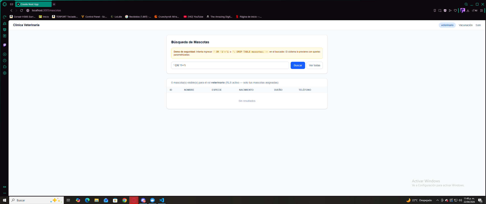
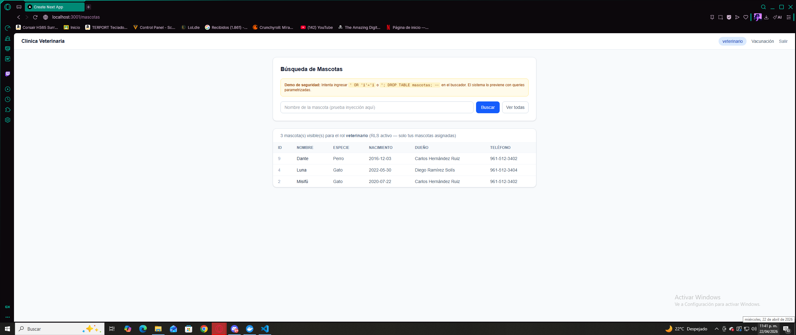
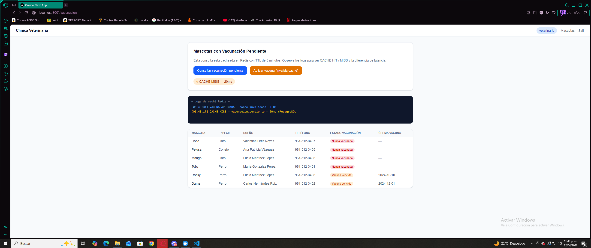

# Cuaderno de Ataques — Clínica Veterinaria · Corte 3 BDA
**Matrícula:** 243726

---

## Sección 1: Tres ataques de SQL Injection que fallan

Para probar los ataques usé el campo de búsqueda de mascotas en `/mascotas`.
Ese campo recibe texto libre del usuario y lo manda al endpoint `GET /api/mascotas/buscar?nombre=<texto>`, que es el punto más obvio para intentar inyección.

---

### Ataque 1 — Quote-escape clásico (`' OR '1'='1`)

**Input exacto que metí en el buscador:**
' OR '1'='1



**Qué esperaba que pasara si fuera vulnerable:**
Que me devolviera todas las mascotas de la base de datos ignorando el filtro del nombre, porque la condición `'1'='1` siempre es verdadera.

**Qué pasó en realidad:**
Devolvió 0 resultados. No apareció ninguna mascota.

**Por qué falló el ataque:**
La línea que lo defiende está en `api/controllers/mascotasController.js`:

```js
const result = await client.query(sql, [`%${nombre}%`]);
```

El `nombre` que viene del usuario se pasa como segundo argumento de `.query()`, no se concatena al texto SQL. El driver `pg` lo manda a PostgreSQL como parámetro separado en el protocolo de red. Entonces `' OR '1'='1` llega a PostgreSQL como el string literal `%' OR '1'='1%` que se busca con ILIKE en el nombre. PostgreSQL no lo interpreta como sintaxis SQL, solo como texto a buscar.

---

### Ataque 2 — Stacked query para borrar tabla (`'; DROP TABLE`)

**Input exacto:**
Firulais'; DROP TABLE mascotas; --


**Qué esperaba que pasara si fuera vulnerable:**
Que ejecutara el DROP TABLE y borrara la tabla mascotas completa.

**Qué pasó en realidad:**
La tabla sigue existiendo. El buscador devolvió 0 resultados porque ninguna mascota se llama literalmente así.

**Por qué falló el ataque:**
El driver `pg` usa el protocolo extendido de PostgreSQL, que no permite meter múltiples statements a través de un parámetro. El `;` y el `DROP TABLE` llegan como parte del valor string que se busca con ILIKE, no como un segundo comando SQL. Es imposible inyectar un segundo statement por esta vía.

---

### Ataque 3 — UNION-based para robar datos de otra tabla

**Input exacto:**
' UNION SELECT id, cedula, nombre, activo::text, '' FROM veterinarios --


**Qué esperaba que pasara si fuera vulnerable:**
Que me devolviera los datos de la tabla `veterinarios` mezclados con los resultados de mascotas, exponiendo cédulas y nombres.

**Qué pasó en realidad:**
Devolvió `[]`. No apareció ningún dato de veterinarios.

**Por qué falló el ataque:**
Mismo mecanismo que los anteriores — el UNION SELECT completo llega como string a buscar con ILIKE, no como SQL. Además aunque hubiera algún error, el `try/catch` del controlador lo captura y solo responde con el mensaje de error, sin exponer nada de la estructura interna de la base de datos.

---

## Sección 2: Demostración de RLS en acción

Los datos del schema ya tienen la distribución hecha:
- `vet_lopez` (vet_id=1) → Firulais, Toby, Max

- `vet_garcia` (vet_id=2) → Misifú, Luna, Dante  

- `vet_mendez` (vet_id=3) → Rocky, Pelusa, Coco, Mango

Para demostrar RLS simplemente inicié sesión con distintos usuarios y fui a la página de mascotas. Los resultados cambian dependiendo de quién esté logueado.

---

**Con `vet_lopez` logueado — aparecen exactamente 3 mascotas:**

```json
[
  { "id": 1, "nombre": "Firulais", "especie": "perro" },
  { "id": 5, "nombre": "Toby",     "especie": "perro" },
  { "id": 7, "nombre": "Max",      "especie": "perro" }
]
```

**Con `vet_garcia` logueado — aparecen otras 3 distintas:**

```json
[
  { "id": 2, "nombre": "Misifú", "especie": "gato" },
  { "id": 4, "nombre": "Luna",   "especie": "gato" },
  { "id": 9, "nombre": "Dante",  "especie": "perro" }
]
```

**Con `administrador` logueado — aparecen las 10 mascotas.**

---

**La política que produce este comportamiento está en `backend/05_rls.sql`:**

```sql
CREATE POLICY pol_mascotas_veterinario
ON mascotas FOR ALL TO rol_veterinario
USING (
    id IN (
        SELECT mascota_id FROM vet_atiende_mascota
        WHERE vet_id = current_setting('app.vet_id', TRUE)::INT
          AND activa = TRUE
    )
);
```

Cuando `vet_lopez` hace login, el backend ejecuta `SET LOCAL app.vet_id = '1'` al inicio de la transacción. PostgreSQL revisa esa política para cada fila de mascotas: solo deja pasar las que tienen su `id` en `vet_atiende_mascota` con `vet_id = 1`. Las demás filas simplemente no aparecen en la respuesta, como si no existieran.

---

## Sección 3: Demostración de caché Redis funcionando

Para ver esto fui a la página `/vacunacion` y usé los dos botones: "Consultar vacunación pendiente" y "Aplicar vacuna (invalida caché)". Los logs aparecen en pantalla en tiempo real.



---

**Secuencia que obtuve al probarlo:**
[04:59:13] CACHE MISS — vacunacion_pendiente — 85ms (PostgreSQL)
[04:59:18] VACUNA APLICADA — caché invalidado
[04:59:27] CACHE MISS — vacunacion_pendiente — 91ms (PostgreSQL)

Y cuando consulté dos veces seguidas sin aplicar vacuna:
[HH:MM:SS] CACHE MISS — vacunacion_pendiente — ~85ms (PostgreSQL)
[HH:MM:SS] CACHE HIT  — vacunacion_pendiente — ~8ms  (Redis)

**Lo que demuestran esos logs:**

- Primera consulta siempre es MISS — va a PostgreSQL y tarda ~85ms
- Segunda consulta inmediata es HIT — Redis responde en ~8ms, que es mucho más rápido
- Al aplicar una vacuna, el endpoint ejecuta `redisClient.del('vacunacion_pendiente')` y borra la key
- La siguiente consulta es MISS de nuevo porque el caché ya no existe, y trae datos frescos de la BD

**Key usada:** `vacunacion_pendiente`

**TTL:** 300 segundos (5 minutos)

**Estrategia de invalidación:** cuando se hace POST a `/api/vacunas/aplicar`, después del INSERT en la base de datos se borra la key de Redis inmediatamente. Así no hay que esperar a que expire el TTL para ver los datos actualizados.